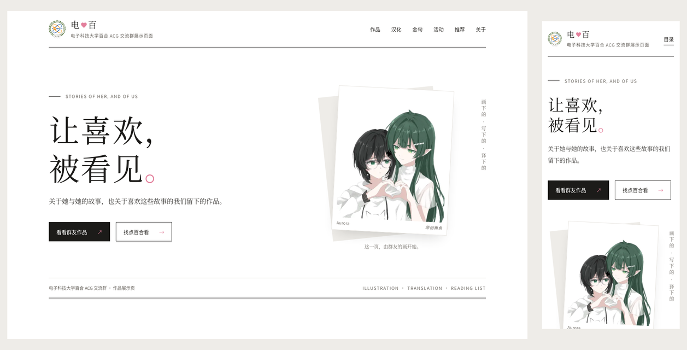

# 电♥百

**电子科技大学百合 ACG 交流群的作品展示页。**

「电」指成电（电子科技大学），「百」指百合。这是一个单页网站，展示群友自己画的、译的、说过的、一起玩过的，以及我们想推荐给你的百合作品。



<sub>截图中的插画 © Aurora，采用 CC BY-NC-ND 4.0，禁止用于 AI 训练。</sub>

## 页面上有什么

| 板块 | 内容 |
|---|---|
| I 群友作品 | 群友的原创插画和原创角色，按作者分组，可以点开看大图 |
| II 群友汉化 | 群友汉化作品的发布位置，只放链接，不转载内容 |
| III 群友金句 | 群里说过、值得记住的话，每条都经过本人同意才公开 |
| IV 群友活动 | 群内活动的记录和截图，例如「你画我猜 · 百合题库」 |
| V 百合推荐 | 漫画、小说和游戏推荐，分为入坑必看、近期热门、新连载速递、群友推荐 |
| VI 关于我们 | 这个群和这个页面是做什么的 |

页脚最底部是网页贡献者名单。

这个网站**只做展示**，不提供入群方式，不放群号或二维码，也不使用学校标识。本群不是学校注册的社团。

## 想改内容？

页面上所有会变的内容都写在 `src/data/` 下的 YAML 文件里，一个板块一个文件，文件开头有注释说明怎么写。改文字、加作品、加活动都**不用碰代码**。

| 想改什么 | 改哪个文件 |
|---|---|
| 标题、首屏、板块标题和顺序、关于我们、页脚 | `src/data/site.yaml` |
| 群友作品 | `src/data/works.yaml` |
| 群友汉化 | `src/data/translations.yaml` |
| 群友金句 | `src/data/quotes.yaml` |
| 群友活动 | `src/data/activities.yaml` |
| 百合推荐 | `src/data/recommendations.yaml` |
| 网页贡献者 | `src/data/contributors.yaml` |

图片放在根目录的 `Pictures/` 里，YAML 里写相对路径即可，例如 `works/Aurora/OC3.jpg`。构建时会自动压缩成 webp。

完整说明、常见操作和 YAML 注意事项见 **[docs/editing.md](docs/editing.md)**。

### 几条规矩

- **金句**：必须先征得本人同意，记录在 [`docs/group_quotes.md`](docs/group_quotes.md)，然后再加进 YAML。
- **图片**：只有已确认可以公开的图片才放进 `Pictures/`，这个目录会随仓库公开。还没发布、或者还没征得同意的素材放在 `Raw_image_materials/`，这个目录不会提交。
- **署名**：只写群昵称，不放联系方式或个人主页。

## 本地运行

需要 Node.js 22.12.0 或更新版本。

```sh
npm install
npm run astro -- dev --background   # 启动开发服务器（后台运行），默认 http://localhost:4321
```

开发服务器运行时，改完 YAML 刷新页面就能看到效果。管理后台服务器：

```sh
npm run astro -- dev status
npm run astro -- dev logs
npm run astro -- dev stop
```

其他命令：

| 命令 | 作用 |
|---|---|
| `npm run build` | 构建到 `dist/`。YAML 写错会在这一步报错，并指出哪个文件、第几项、错在哪 |
| `npm run preview` | 构建后用 Wrangler 在本地预览 |
| `npm run deploy` | 构建并部署到 Cloudflare |
| `npx astro check` | 类型检查 |

## 技术说明

- **[Astro](https://astro.build) 静态站点**：构建产物是纯 HTML/CSS/JS 加压缩后的图片，通过 Wrangler 部署到 Cloudflare，配置见 `wrangler.jsonc`。
- **内容与代码分离**：`src/lib/content.ts` 在构建时读取并校验 YAML，写错时给出中文报错。
- **图片白名单**：`src/integrations/pictures.mjs` 只导入 YAML 里实际引用到的图片，`Pictures/` 里没被引用的图不会进入构建产物。页面只使用压缩后的版本。
- **没有框架和追踪**：页面交互（菜单、筛选、大图浏览、滚动动效）是一个很小的原生 TypeScript 脚本，不引入前端框架，也不做访问统计。
- **无障碍**：尊重系统的「减少动态效果」设置，支持键盘操作，手机和桌面都适配。

### 目录

| 路径 | 内容 |
|---|---|
| `src/data/` | 页面内容（YAML） |
| `src/pages/index.astro` | 页面入口，按 `site.yaml` 的顺序拼装各板块 |
| `src/layouts/Layout.astro` | 页面外壳：`<head>`、爱心图标、大图浏览层 |
| `src/components/` | 各板块组件 |
| `src/lib/` | 读取和校验数据、图片解析 |
| `src/integrations/pictures.mjs` | 图片白名单插件 |
| `src/styles/global.css` | 全站样式，配色和字体在开头的 `:root` 里 |
| `src/scripts/site.ts` | 页面交互 |
| `Pictures/` | 已确认公开的图片 |
| `public/` | 原样发布的文件：`robots.txt`、`favicon.svg` |
| `docs/` | 维护说明、许可、资料整理、已知问题 |
| `demo_claude/` | 静态设计示例，直接双击打开 |
| `design-demos/` | 早期的三版设计稿和选择记录 |

### 文档

| 文件 | 内容 |
|---|---|
| [`docs/editing.md`](docs/editing.md) | 怎么改网页内容 |
| [`docs/claude_recommendation.md`](docs/claude_recommendation.md) | 页面结构和文案的设计决定 |
| [`docs/artwork_license.md`](docs/artwork_license.md) | 群友原创图片的许可 |
| [`docs/yuri_artworks.md`](docs/yuri_artworks.md) | 推荐作品的完整资料和核实记录 |
| [`docs/translation_works.md`](docs/translation_works.md) | 群友汉化记录 |
| [`docs/group_quotes.md`](docs/group_quotes.md) | 金句征集与同意记录 |
| [`docs/known_issues.md`](docs/known_issues.md) | 已知但暂时不修的问题 |

## 许可

这个仓库里的内容分几种许可，请注意区分：

| 内容 | 许可 |
|---|---|
| 网页源码（HTML、CSS、JS、Astro 组件和配置） | [MIT](LICENSE) |
| 群友原创图片（`Pictures/works/`） | [CC BY-NC-ND 4.0](https://creativecommons.org/licenses/by-nc-nd/4.0/deed.zh-hans)，另外**禁止用于 AI 训练**，详见 [`docs/artwork_license.md`](docs/artwork_license.md) |
| 推荐作品的封面（`Pictures/manga_cover/`、`Pictures/game_cover/`） | 版权归原出版方，仅用于介绍 |
| Logo 和群友头像 | 不在 MIT 许可范围内，版权归各自所有者 |

MIT 许可**只覆盖源码**。群友的画可以署名后原样转发，但不能修改、不能商用、不能拿去训练 AI。

## 贡献者

- **开发与设计**：HZ-TYZQ & Anthropic Claude
- **内容整理**：HZ-TYZQ & Anthropic Claude & OpenAI ChatGPT
- **素材提供**：Aurora、冬之雪、柴猫猫、古明地道战、HZ-TYZQ

名单以页面页脚和 `src/data/contributors.yaml` 为准。
